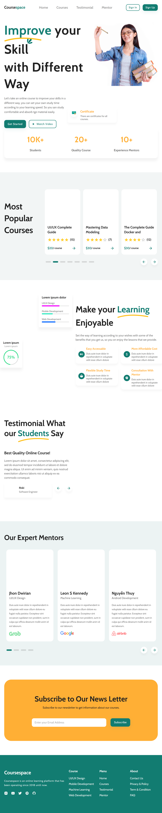

<h1 align="center">🚀 Coursespace</h1>

<p align="center">
Modern and fully responsive landing page built with Next.js and React.
</p>

---

## 📸 Screenshot



---

## 🧾 Description

This project is a clean and professional landing page designed for online courses, educational platforms, and digital products. It is fully responsive and optimized for all screen sizes.

---

## ✨ Features

* Fully Responsive Design 📱
* Modern UI/UX 🎨
* Built with Next.js & React ⚛️
* Material UI Components 💎
* Smooth Scrolling Navigation 🔥
* Clean & Structured Code 🧩

---

## 🛠️ Tech Stack

* Next.js
* React
* Material UI (MUI)
* JavaScript
* CSS

---

## 🚀 Getting Started

Install dependencies:

```bash
npm install
```

Run development server:

```bash
npm run dev
```

Open in browser:

```
http://localhost:3000
```

---

## 🌐 Live Demo

👉 landing-page-xi-rosy-15.vercel.app
---

## 👨‍💻 Author

Abdul Rehman

---

## 📌 Note

This project is inspired by existing templates but fully customized with improved design, responsiveness, and structure.

---
